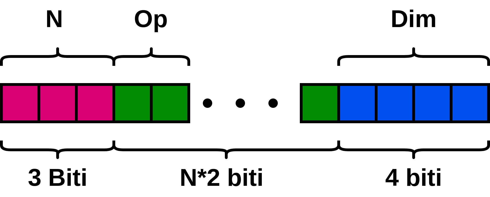

<div id="top"></div>

[![MIT License][license-shield]][license-url]


<!-- PROJECT LOGO -->
<br />
<div align="center">
  <a href="https://github.com/miron-boiangiu/miniprocessor">
    
  </a>

<h3 align="center">Miniprocessor</h3>

  <p align="center">
    CLI Calculator which interprets 32-bit commands, enabling it to sum, subtract, divide and multiply numbers.
    <br />
    <br />
    <a href="https://github.com/miron-boiangiu/miniprocessor/issues">Report Bug</a>
    ·
    <a href="https://github.com/miron-boiangiu/miniprocessor/issues">Request Feature</a>
  </p>
</div>


<!-- TABLE OF CONTENTS -->
<details>
  <summary>Table of Contents</summary>
  <ol>
    <li>
      <a href="#about-the-project">About The Project</a>
      <ul>
        <li><a href="#built-with">Built With</a></li>
      </ul>
    </li>
    <li>
      <a href="#getting-started">Getting Started</a>
      <ul>
        <li><a href="#prerequisites">Prerequisites</a></li>
      </ul>
    </li>
    <li><a href="#usage">Usage</a></li>
    <li><a href="#license">License</a></li>
    <li><a href="#contact">Contact</a></li>
  </ol>
</details>


<!-- ABOUT THE PROJECT -->
## About The Project

A simple "processor" which interprets commands of a special format and does calculations according to them.

<br>
<a href="https://ocw.cs.pub.ro/courses/programare/teme_2021/tema1_2021_cbd">Assignment link.</a>

<p align="right">(<a href="#top">back to top</a>)</p>


### Built With

* [C](http://www.open-std.org/jtc1/sc22/wg14/)


<p align="right">(<a href="#top">back to top</a>)</p>


<!-- GETTING STARTED -->
## Getting Started


### Prerequisites

* make & gcc
  ```sh
  sudo apt-get install build-essential
  ```

### Compilation

1. Simply use the makefile included in order to compile the program.
   ```sh
   make
   ```
2. You can then run the program by running ./task1 or ./task2.
   ```sh
   ./task1
   ```

<p align="right">(<a href="#top">back to top</a>)</p>


<!-- USAGE EXAMPLES -->
## Usage
The program asks for the formatted command once it's ran, simply input it manually or by running it in a terminal and redirecting some input.

A command has the following format:  
<br>
  
<br>
Where:  
- N: the number of mathematical calculations, written as a 3-bit number.  
- OP: the code corresponding to a type of calculation.  
    - 00: +  
	- 01: -  
	- 10: *  
	- 11: /  
- DIM: size of an operand, represented as a 4-bit number. DIM is calculated by converting the 4 bits to decimal and adding 1 to the resulting number.

#### Example of usage:

* []() Task1:    
	```
	Input: 1675493376 → Output: 4 + - / * 16  
	Input: 2483421184 → Output: 5 * * + + + 13  
	```
* []() Task2:     
	```
	Input: 1410859008  
	Interpretation: 3 * * + 4  
	Numbers to be read = 1  
	Number entered: 54999  
	Operands: 13 6 13 7  
	Output: 1021  
	```
	```
	Input: 1947074560  
	Interpretation: 4 * * + + 8  
	Numbers to be read = 3  
	Numbers read: 54998  
	64041  
	42752  
	Operands:214 214 250 41 167 0 0 0 0 0  
	Output: 11449208  
	```
<p align="right">(<a href="#top">back to top</a>)</p>


<!-- LICENSE -->
## License

Distributed under the MIT License. See `LICENSE.txt` for more information.

<p align="right">(<a href="#top">back to top</a>)</p>


<!-- CONTACT -->
## Contact

Boiangiu Victor-Miron - miron.boiangiu@gmail.com

Project Link: [https://github.com/miron-boiangiu/miniprocessor](https://github.com/miron-boiangiu/miniprocessor)

<p align="right">(<a href="#top">back to top</a>)</p>


<!-- MARKDOWN LINKS & IMAGES -->
<!-- https://www.markdownguide.org/basic-syntax/#reference-style-links -->
[contributors-shield]: https://img.shields.io/github/contributors/github_username/repo_name.svg?style=for-the-badge
[contributors-url]:https://github.com/miron-boiangiu/miniprocessor/graphs/contributors
[forks-shield]: https://img.shields.io/github/forks/github_username/repo_name.svg?style=for-the-badge
[forks-url]:https://github.com/miron-boiangiu/miniprocessor/network/members
[stars-shield]: https://img.shields.io/github/stars/github_username/repo_name.svg?style=for-the-badge
[stars-url]:https://github.com/miron-boiangiu/miniprocessor/stargazers
[issues-shield]: https://img.shields.io/github/issues/github_username/repo_name.svg?style=for-the-badge
[issues-url]:https://github.com/miron-boiangiu/miniprocessor/issues
[license-shield]: https://img.shields.io/github/license/miron-boiangiu/miniprocessor.svg?style=for-the-badge
[license-url]:https://github.com/miron-boiangiu/miniprocessor/blob/master/LICENSE
[linkedin-shield]: https://img.shields.io/badge/-LinkedIn-black.svg?style=for-the-badge&logo=linkedin&colorB=555
[linkedin-url]: https://linkedin.com/in/linkedin_username
[product-screenshot]: images/screenshot.png
